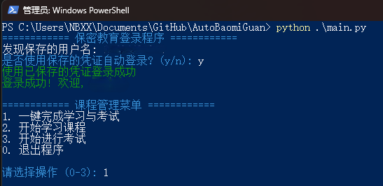

# AutoBaomiGuan

[保密观](https://www.baomi.org.cn)自动刷课与答题脚本。

> [!IMPORTANT]
> 此脚本适用于 [2026年度全国保密教育线上培训](https://www.baomi.org.cn/bmCourseDetail/info?id=312bc914-8e11-421b-b9bc-e900fe1a4e50)。

> [!WARNING]
> 若新账号运行出现`登录失败或token无效`等[报错](https://github.com/NB-XX/AutoBaomiGuan/issues/10)，请先在网页端手动播放任意课程视频后，再重新启动此脚本。

## 使用方法

**免环境运行（仅限 Windows）**  
直接下载预打包的 [AutoBaomiGuan.exe](https://github.com/NB-XX/AutoBaomiGuan/releases/latest/download/AutoBaomiGuan.exe)，双击运行即可。

**源码运行（需 Python 环境）**  
克隆代码至本地后，安装依赖并运行：

```bash
pip install -r requirements.txt
python main.py
```
运行后根据终端提示，可选择扫描二维码登录，或直接输入账号密码登录。
 
